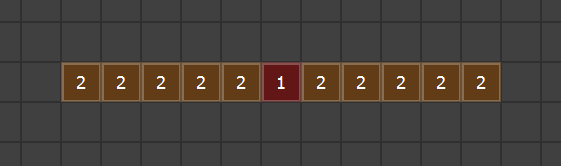
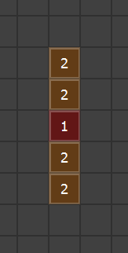
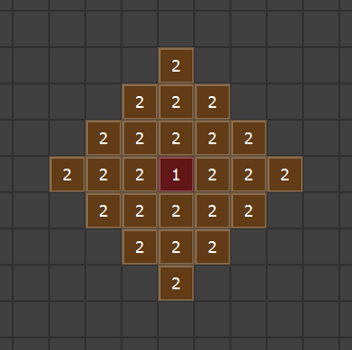

# TriggerDistance

## Introduction

This plugin allows you to set up Player Touch activation that covers an area or line of tiles around it. It is mainly used to avoid duplicating the same Event multiple times in order to cover more than one square. By specifying your parameters in a comment on an Event page, the Player Touch Trigger can be fired when your Player is at a specified distance from the Event and/or on a certain axis. I've also added functionality to list specific modes of travel that will trigger an event. Now you can fly your airship to a floating island but not walk or sail into it from the ground. Yay!

## Features
* Adds the ability to specify which modes of travel will activate a Player Touch Trigger.
* Saves a ton of time. Who hasn't copied events and pasted them on multiple nearby squares and then need to change something which forces you to delete them all and re-paste the change back in? Now you just have one event to deal with.
* Easily do an edge transfer with a single event.
* Easily span an Event across a wide hallway that starts a cut scene.
* Make an NPC talk to you when you get near them without forcing the player to walk all the way to them and initiate the conversation.
* Makes your project leaner by reducing the amount of events that need to be tracked and processed.
* Can save on switches when you have lots of copied events that need to turn off together when activated.

## How to Use

On an Event page that has a Player Touch trigger, create a Comment and enter it in this format: <TriggerDistance: parameters>
Parameters are separated by a space.

The following parameters are supported. Each one is immediate**ly followed by a number to specify the distance in squares/tiles that the Event should fire.**
*** **r#** - Radius (Any square within # of Event)
* **x#** - X-Axis (Any square within # of Event on the X-Axis [left/right])
* **y#** - Y-Axis (Any square within # of Event on the Y-Axis [up/down])
* **s#** - Switch Binding (Will turn ON the specified Switch ID and not fire again while the Switch is on)

These can also be specified in the parameters to indicate which modes of travel this event will fire for. If you specify none then the Player Touch will always trigger.
* walk - Player Touch will trigger if you are walking
* boat - Player Touch will trigger if you are on your boat
* ship - Player Touch will trigger if you are on your ship
* airship - Player Touch will trigger if you are on your airship

Examples:

X-Axis: **<TriggerDistance: walk x5>**
###### Will cover the Event square and 5 tiles to the left and right of it. Great for spanning a large hallway or exit. Only fires when walking.

Y-Axis: **<TriggerDistance: boat y2>**
###### Will cover the Event square and 2 tiles above and below of it. Only fires when in your boat.

Radius: **<TriggerDistance: walk r3>**
###### Will cover the Event square and 3 tiles in all directions. Only fires when walking.

Edge Transfer: **<TriggerDistance: x999>**
###### Will cover the the entire edge of the top or bottom of a map. It doesn't have to be the top or bottom edge but that's what it is typically used for. The number is set purposely large to cover any size map. Fires for all modes of travel.

Edge Transfer: **<TriggerDistance: y999>**
###### Will cover the the entire edge of the left or right of a map. It doesn't have to be the left or right edge but that's what it is typically used for. The number is set purposely large to cover any size map. Fires for all modes of travel.

Radius with Switch: **<TriggerDistance: r2 s12>**
###### Will cover the Event square and 2 tiles in all directions, will turn on Switch ID 12 and not fire an Event Touch again while Switch 12 is ON. Fires for all modes of travel.

Player Touch only fires when you are in your airship: **<TriggerDistance: airship>**
###### No radius, x or y specified so this only covers the event tile.

## Terms of Use

This plugin can be used in commercial or non-commercial projects.
Credit Frogboy in your work.

## Changelog

Version 1.01 - Initial Release
